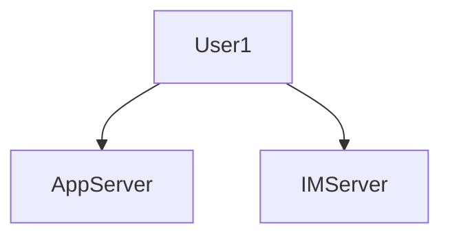
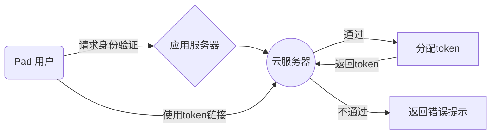

# markdown flow

官网： https://mermaidjs.github.io/

# flow

```mermaid
graph TD;
    User1 --> AppServer;
		User1 --> IMServer;
```

# sequenceDiagram

```mermaid
graph LR
    A(Pad 用户) -->|请求身份验证| B{应用服务器}
    B --> C((云服务器))
    C -->|通过| D[分配token]
    D -->|返回token| C
    C -->|不通过| E[返回错误提示]
    A -->|使用token链接| C((云服务器))
```