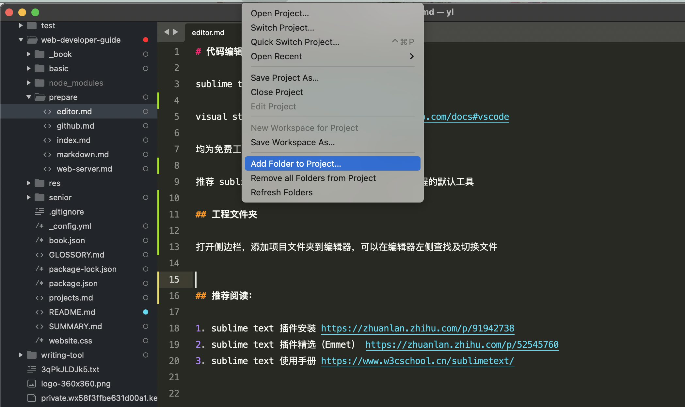

# 代码编辑工具

sublime text  https://www.sublimetext.com/

visual studio code https://code.visualstudio.com/docs#vscode

均为免费工具，均支持插件，任选其一安装

推荐 sublime text，这是作者的默认工具，为后续课程的默认工具

## 工程文件夹

打开侧边栏，添加项目文件夹到编辑器，可以在编辑器左侧查找及切换文件

## 推荐阅读：

1. sublime text 插件安装 https://zhuanlan.zhihu.com/p/91942738
2. sublime text 插件精选（Emmet） https://zhuanlan.zhihu.com/p/52545760 
3. sublime text 使用手册 https://www.w3cschool.cn/sublimetext/

