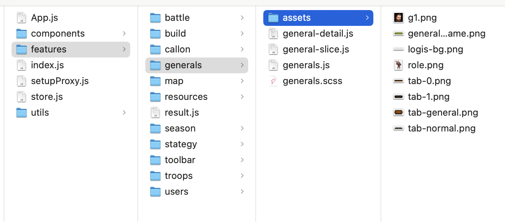

# 代码运行环境

代码需要在本地编写调试、预览看效果，因此除了编写工具外，还需要运行环境（nodejs + svrx）和访问软件（浏览器）。

1. 安装 nodejs http://nodejs.cn/  ，svrx https://www.npmjs.com/package/@svrx/svrx
1. 浏览器可使用 firefox/safari/chrome，推荐 chrome

>   严格注意：所以前端的预览调试必须在 http(s) 协议下
>
>   打开地址栏，确保是以 http 开头，而不是 file://

## 相对路径与绝对路径

代码需要引用其他资源，比如页面引用 css、js、图片/视频等文件，css 引用背景图片等。

这就设计路径问题，本地计算机的路径一般为 `/Users/shuise/web-developer-guide/basic/res` 或 `files:///d:/shuise/web-developer-guide/basic/res`，这些路径只在本地有效，代码部署到服务器端就会时效，因为服务器是不可能保持本地文件树架构。

解决这个问题就是靠站点，基于本地某个 `目录 S`运行 svrx 服务，就等于指定 `目录 S` 为网站根目录，开发完成后把 `目录 S` 部署到服务器并指定为根目录，即可保持远端与本地的一致性。

因此，在写代码时，不允许引用 `目录 S` 之外的其他本地文件，所有用到的文件必须复制到 `目录 S` 下后再引用。

**引用路径规则**如下：

1.   绝对路径：以 `/` 开始，代表从根目录开始查找，比如 `" `，适用于全站导航、favicon 等少量全局固定文件，当前文件在任意位置均可引用；
2.   相对路径：以 `./`(当前目录)  或 `../`（父级目录） 开始，相对当前文件开始查找，比如 `` ，代表与页面平级 src 目录下的图片 xxx，默认路径规则，现代工程中一般分模块处理，每个模块单独管理自身独有的所有资源。

## 推荐阅读：

1. nodejs 的包安装方式 npm http://nodejs.cn/learn/an-introduction-to-the-npm-package-manager
1. svrx https://svrxjs.github.io/svrx-docs/zh/
1. firefox 下载地址 https://www.mozilla.org/en-US/firefox/new/?redirect_source=firefox-com
1. chrome 下载地址 https://www.google.com/chrome/
1. safari 为苹果电脑自带