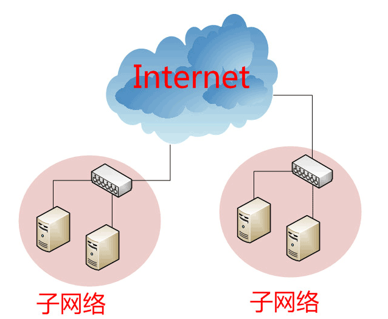
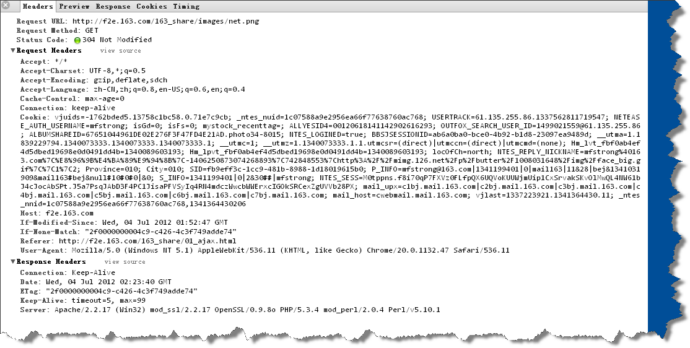

# http 协议


## 网络与http(s)协议



### 相关链接：

[互联网协议入门（一）](http://www.ruanyifeng.com/blog/2012/05/internet_protocol_suite_part_i.html)
[互联网协议入门（二）](http://www.ruanyifeng.com/blog/2012/06/internet_protocol_suite_part_ii.html)

## URI与GET请求

1.  URI是什么？
2.  为什么是GET？
3.  原生的GET有那些？
4.  http请求都有哪些类型？

### 相关链接：

[HTTP协议详解](http://www.cnblogs.com/TankXiao/archive/2012/02/13/2342672.html)
[w3c官网](http://www.w3.org/Protocols/rfc2616/rfc2616-sec9.html#sec9.1)

## 调试工具(fiddler，浏览器自带工具等)

1.  fiddler(.net framework)
2.  firebug
3.  chrome自带工具



## 同源策略

1.  什么是同源？
2.  为什么需要同源策略？

```
location.href = location.protocal + "//" + location.host + ":" + location.port + location.pathname + location.hash
```


## fetch


### 相关链接：

[CORS(Cross-Origin Resource Sharing)](http://newhtml.net/using-cors/#more-366)


请求类型


阻塞式加载


fetch

promise

axios


## 低代码平台、数据服务

airtable、notion